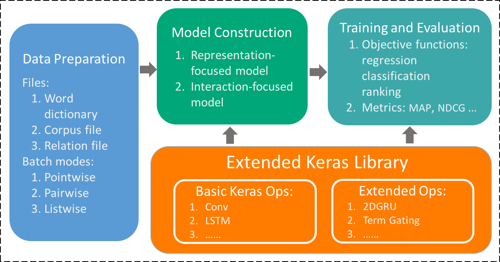
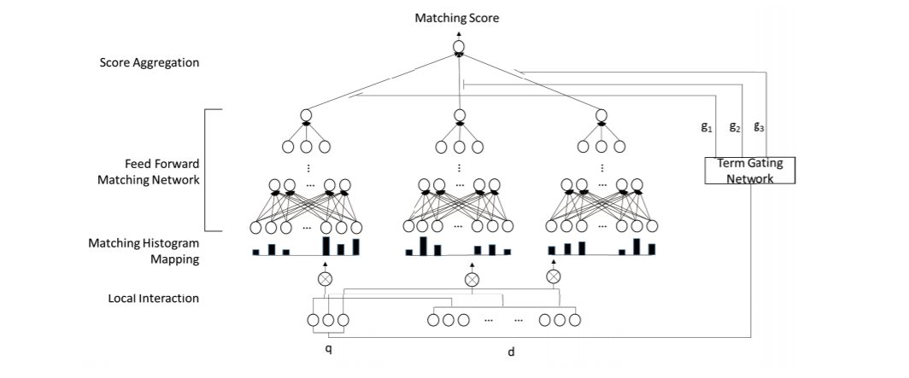

## Report for (DRMM_TKS)NLPForLayer

#### Outline

> 1. Abstract
> 2. Overview
> 3. Data Preparation
> 4. Training
> 5. Evaluation
> 6. Experiment Results
> 7. How to Run the Project


### Abstract 


During the one-month internship, I had some understanding of the NLP field and learned about Keras and DRMM_TKS model. On this basis, I completed the algorithmic task of Legal Robot.First, learning about MatchZoo, which is an open source framework, and fully understand it by querying data . Secondly, I processed the original data and implemented data preprocessing, Training and final prediction accordingly.Finally, I am working on an extension of the open source framework, which is currently underway.


## Overview
The architecture of the project is described in the Figure  in what follows,
 

There are three major modules in the project, namely data preparation, model construction, training and evaluation, respectively. These three modules are actually organized as a pipeline of data flow.


### Data Preprocessing


The data in the real-world dataset, is in the form of  "label/sentence 1/sentence 2". And there also has many things for us to deal with. Firstly, to  transform the word into vectors, we should split the sentence into words. And in this part, I use the solution which called "jieba" to do the Chinese word segmentation.

And  the second part is the word embedding. To guarantee the efficiency of the embedding, I import the external pre-trained word embedding with 300 dimensionalties, which includes the original data from Baidu Encyclopedia, People's Daily News, Complete Library in Four Sections, etc. And to promise the embedding includes any words appeared in my training data, I use the training data as the input, to train another word embedding, which could be seen as a substitution of original dictionary. And the experiment has prove that, approximately one in 54.86 of words are using the substituted dictionary in the word embedding.

The data preparation module aims to convert dataset of different text matching tasks into a unified format as the input of deep matching models. Users provide datasets which contains pairs of texts along with their labels, and the module produces the following files.

+	**Word Dictionary**: records the mapping from each word to a unique identifier called *wid*. Words that are too frequent (e.g. stopwords), too rare or noisy (e.g. fax numbers) can be  filtered out by predefined rules.
+	**Corpus File**: records the mapping from each text to a unique identifier called *tid*, along with a sequence of word identifiers contained in that text. Note here each text is truncated or padded to a fixed length customized by users.
+	**Relation File**: is used to store the relationship between two texts, each line containing a pair of *tids* and the corresponding label.


### Training

Since the ad-hoc retrieval task is fundamentally a ranking problem, we employ a pairwise ranking loss such as hinge loss to train our deep relevance matching model. Given a triple (q, d+, d−), where document d + is ranked higher than document d − with respect to query q, the loss function is defined as:
L(q, d+, d−; Θ) = max(0, 1 − s(q, d+) + s(q, d−))
where s(q, d) denotes the predicted matching score for (q, d),and Θ includes the parameters for the feed forward matching network and those for the term gating network. The optimization
is relatively straightforward with standard backpropagation[29]. We apply stochastic gradient descent method Adagrad [4] with mini-batches (20 in size), which can be easily parallelized on single machine with multi-cores. For regularization, we find that the early stopping [9] strategy works well for our model.



### Evaluation

Given the limited number of queries for each collection,I conduct 5-fold and 3-fold cross-validation to minimize over-fitting without reducing the number of learning instances. Topics for each collection are randomly divided into 5 folds and 3 fold. The parameters for each model are tuned on 3-of-5 folds. The final fold in each case is used to evaluate the optimal parameters. This process is repeated 5 times, once for each fold. Mean average precision (MAP) is the optimized metric for all retrieval models. Throughout this paper each displayed evaluation statistic is the average of the five fold-level evaluation values. For evaluation, the top-ranked 1, 000 documents are compared using the mean average precision (MAP), normalized discounted cumulative gain at rank 20 (nDCG@20), and precision at rank 20 (P@20). Statistical differences between models are computed using the Fisher randomization test [24] (α = 0.05). Note that for all the deep matching models, I adopt a re-ranking strategy for efficient computation. An initial retrieval is performed using the QL model to obtain the top 2, 000 ranked documents. We then use the deep matching models to re-rank these top results. The top-ranked 1, 000 documents are then used for comparison.


### Experiment Results


In this chapter, I will show you the result of the contrast experiment.  And the index of the estimation is NDCG@3,NDCG@5 and Predict MAP .

|      Models     |  NDCG@3   |  NDCG@5  |   MAP    |
| :--------------: | :---------: | :---------: | :---------: |
|  **DRMM_TKS**  | **0.6213** | **0.6407** | **0.6302** |


### How to Run the Project

After you download the project and the dataset,you could run the project in the following steps.
Placing the initial file 'sample.txt'  on  data/ranking

```python
python preparation.py
python preprocessing.py
python gen_w2v.py  parameter1 parameter2 parameter3
python main/main.py --phase train --model_file examples/wikiqa/config/drmm_tks_wikiqa.config
python main/main.py --phase predict --model_file examples/wikiqa/config/drmm_tks_wikiqa.config
```


#### Reference

[1] Hu,Baotian, Zhengdong Lu, Hang Li, and Qingcai Chen. "Convolutional neuralnetwork architectures for matching natural language sentences." InAdvances in neural information processing systems, pp. 2042-2050. 2014.

[2] Huang,Po-Sen, Xiaodong He, Jianfeng Gao, Li Deng, Alex Acero, and Larry Heck."Learning deep structured semantic models for web search usingclickthrough data." In Proceedings of the 22nd ACM internationalconference on Conference on information & knowledge management, pp.2333-2338. ACM, 2013.

[3] Shen,Yelong, Xiaodong He, Jianfeng Gao, Li Deng, and Grégoire Mesnil. "A latentsemantic model with convolutional-pooling structure for informationretrieval." In Proceedings of the 23rd ACM International Conference onConference on Information and Knowledge Management, pp. 101-110. ACM, 2014.

[4] https://github.com/usnistgov/trec_eval

[5] https://nlp.stanford.edu/projects/glove/
